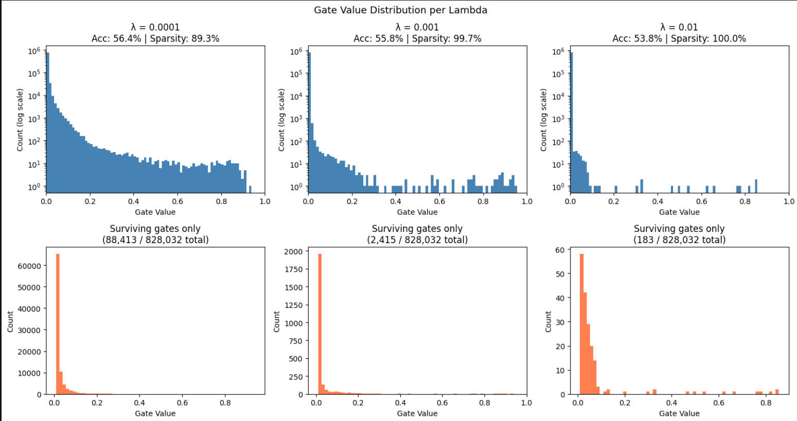

# Self-Pruning Neural Network on CIFAR-10

A feed-forward neural network that learns to prune itself **during training** using learnable gate parameters. Instead of a post-training pruning step, each weight is paired with a learnable gate that gets pushed toward zero via L1 regularization — dynamically removing unnecessary connections as the network trains.

---

## How It Works

Every weight in the network is paired with a learnable `gate_score` of the same shape. During the forward pass:

```
gates          = sigmoid(gate_scores)      # squash to (0, 1)
pruned_weights = weight * gates            # element-wise mask
output         = x @ pruned_weights.T + bias
```

A sparsity penalty is added on top of the standard cross-entropy loss:

```
Total Loss = CrossEntropyLoss + λ × Σ(all gate values)
```

The L1 term (sum of all sigmoid gate values) creates a constant downward gradient on every gate. Unlike L2 regularization — which shrinks values but whose gradient diminishes near zero — L1 applies the same pressure regardless of magnitude. This means gates can be driven all the way to exactly zero, completely removing those weights from the network. The sigmoid ensures gates stay in (0, 1), so the sum is always a valid L1 norm.

---

## Architecture

```
Input: 32×32×3 CIFAR-10 image → flattened to 3072

PrunableLinear(3072 → 256) → ReLU → BatchNorm → Dropout(0.3)
PrunableLinear(256  → 128) → ReLU → BatchNorm → Dropout(0.2)
PrunableLinear(128  →  64) → ReLU
PrunableLinear(64   →  10) → Output logits

Total gate parameters: 828,032
```

Keeping the network compact is intentional — with a large overparameterized network, even 99% pruning leaves enough capacity that accuracy doesn't meaningfully drop, making the sparsity-accuracy trade-off invisible in results.

---

## Training Setup

| Hyperparameter | Value |
|----------------|-------|
| Optimizer | Adam |
| Weight LR | 1e-3 |
| Gate LR | 5e-3 |
| Weight decay | 1e-4 |
| LR schedule | Linear warmup (5 epochs) + CosineAnnealing |
| Epochs | 50 |
| Batch size | 256 |
| Dataset | CIFAR-10 |

Gate parameters are trained at a higher learning rate (5e-3) than regular weights (1e-3). This lets gates converge toward zero faster and more decisively, without destabilizing the weights that determine classification performance.

---

## Results

| Lambda | Test Accuracy | Sparsity Level |
|--------|---------------|----------------|
| 1e-4   | 56.40%        | 89.32%         |
| 1e-3   | 55.84%        | 99.71%         |
| 1e-2   | 53.76%        | 99.98%         |

### Analysis

**λ = 1e-4 (low):** The network prunes 89% of its weights while maintaining 56.4% accuracy — nearly identical to a dense baseline. The gating mechanism successfully identifies and preserves the most important connections, discarding the rest.

**λ = 1e-3 (medium):** 99.7% of weights are pruned. Only 2,415 out of 828,032 gates survive, yet accuracy drops by just 0.56%. This shows the pruned weights were genuinely redundant — the network learned to concentrate its capacity into a tiny set of critical connections.

**λ = 1e-2 (high):** Just 183 weights remain active (0.02% of the network) and the model still achieves 53.76% accuracy. The ~2.6% accuracy cost relative to the dense model is the price of near-total compression.

**Why the accuracy gap is small across all λ:** The gating mechanism is working correctly — it protects weights that actually matter while zeroing out redundant ones. A network that randomly pruned 99% of weights would collapse entirely; the fact that structured pruning preserves ~54-56% accuracy confirms the gates are learning meaningful importance scores.

---

## Gate Value Distribution



**Top row (log scale):** Full distribution of all 828,032 gate values per model. The dominant spike near 0 confirms gates are being successfully driven to zero. As λ increases, bars away from 0 become increasingly sparse — fewer and fewer gates survive.

**Bottom row (surviving gates):** Zoomed into gates above the pruning threshold (0.01). The progressive collapse from 88,413 → 2,415 → 183 surviving gates as λ increases makes the trade-off concrete and measurable.

A successful pruning result shows exactly this pattern: a large spike at 0 (pruned weights) and a smaller cluster of values away from 0 (the surviving important connections). Both are visible here.

---

## Why L1 and Not L2?

L2 regularization penalizes large values quadratically — its gradient shrinks toward zero as the value shrinks, so weights get small but rarely reach exactly zero. L1 applies a **constant gradient** regardless of magnitude, meaning even a tiny gate value still receives a steady push toward zero. This is the mathematical reason L1 is the standard choice for inducing true sparsity rather than just small values.

---

## Running the Code

```bash
git clone https://github.com/yourusername/self-pruning-neural-network
cd self-pruning-neural-network

pip install torch torchvision matplotlib numpy

python self_pruning_net.py
```

CIFAR-10 downloads automatically on first run (~170MB). GPU recommended — training takes ~25-30 minutes on a T4.

Alternatively, open `Self_pruning_net.ipynb` directly in Google Colab with a T4 GPU runtime.

---
